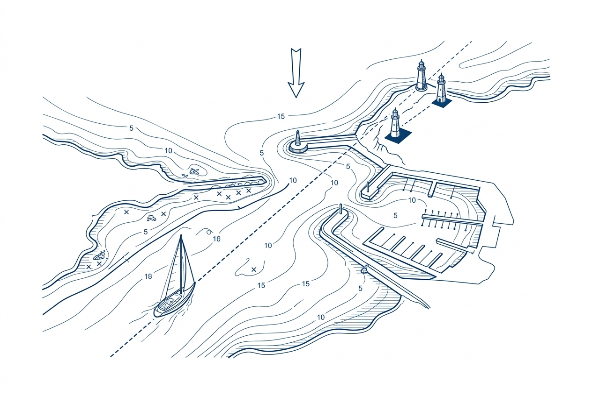

# Skipper App



A quick-fire learning app for RYA Day Skipper sailing theory. Built for anyone preparing for the Day Skipper theory exam, covering all the core topics from nautical terms and navigation to weather, tides, and passage planning.

All content is sourced from publicly available RYA Day Skipper materials found on the web.

## How it works

Pick a topic, then work through three study modes:

1. **Facts** - read through key concepts with illustrations
2. **Flashcards** - test recall with flip cards on key terms and definitions
3. **MCQ Quizzes** - multiple-choice questions with explanations

A **Mixed Quiz** mode pulls 20 random questions across all topics for broader revision.

Progress is tracked per topic with mastery levels (seen, practised, passed, mastered) so you can focus on weaker areas.

## Tech stack

- React 19 + TypeScript
- TanStack Router (file-based routing)
- Tailwind CSS + shadcn/ui
- Vite
- Vitest for testing
- Deployed on Netlify

## Getting started

```bash
npm install
npm run dev
```

Runs on `http://localhost:3000`.

## Testing

```bash
npm test
```
